# PrimeBill ISP Platform — API

[Branding & nomenclature → BRANDING.md](BRANDING.md)

> **PrimeBill ISP Platform** (short brand: **PrimeBill**) is a multi-tenant ISP OSS/BSS platform built with Laravel. It provides the backend foundation for subscriber management, billing, payments, network provisioning, FreeRADIUS, MikroTik, FTTH/OLT operations, inventory, support, CRM, communications, reporting, security, and PrimeBill ISP Platform SaaS/platform administration.


---

## 1. Product Overview

PrimeBill ISP Platform is designed as a complete ISP business and network operations backend rather than a simple billing application.

The platform connects:

- SaaS/platform administration
- Multi-tenant ISP management
- Customer and service lifecycle
- ISP plans and network services
- MikroTik and FreeRADIUS provisioning
- RADIUS accounting and sessions
- IP address management
- OLT, ONT and fiber infrastructure
- Invoices, payments, allocations and ledger accounting
- Taxes, discounts, refunds and credit/debit notes
- Dunning and collections
- Inventory and procurement
- Tickets, SLA, maintenance and work orders
- CRM and customer experience
- SMS, templates, campaigns and communications
- Network operations and telemetry
- Reporting and scheduled reports
- Security, authentication and auditability

The system is organized around ten major platform phases.

---

# 2. Master Platform Scope

| Phase | Domain | Core Capabilities |
|---|---|---|
| 01 | Platform | Roles, permissions, admins, tenants, SaaS plans, subscriptions, users, settings |
| 02 | Network Foundation | Routers, Router Management, RADIUS, IPAM, NOC, OLT, Fiber, ONT |
| 03 | Customer Foundation | ISP Plans, Clients, Client Accounts, Wallets, Client Enrichment |
| 04 | Billing | Taxes, Discounts, Invoices, Payments, Allocations, Ledger, Usage, Refunds, Credit/Debit Notes, Dunning |
| 05 | Inventory | Warehouses, Suppliers, Inventory Items, Stock Movements, Purchase Orders, Assignments |
| 06 | Support | Departments, Queues, Categories, SLA Policies, Knowledge Base, Tickets, Maintenance, Work Orders, Work Order Parts |
| 07 | CRM / Communication | Leads, Campaigns, Customer Experience, Templates, Communication Logs, Notifications, Announcements, Webhooks |
| 08 | Operations | RADIUS Sessions, Network Traffic, ONT Signal History, ONT Events, SMS Logs |
| 09 | Reporting | Dashboards, Saved Reports, Report Schedules |
| 10 | Security | Security Events, User Devices, Login History, MFA Recovery Codes |

---

# 3. System Architecture

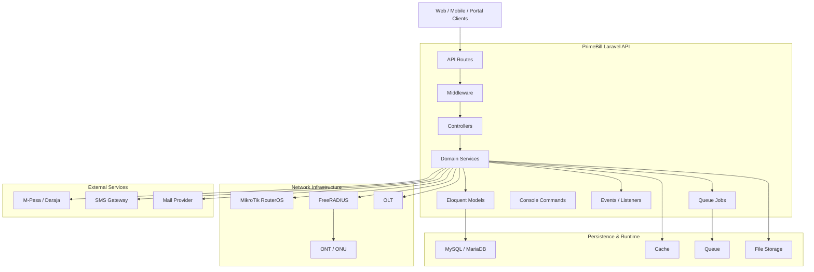

---

# 4. Domain Dependency Map

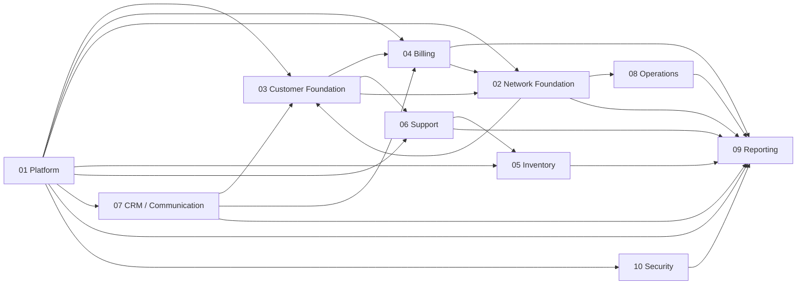

---

# 5. Phase 01 — Platform

## Scope

- Roles
- Permissions
- Admin users
- Tenants
- SaaS plans
- Tenant subscriptions
- Tenant users
- Tenant settings
- Feature flags and quotas
- Platform administration
- Cross-tenant auditability

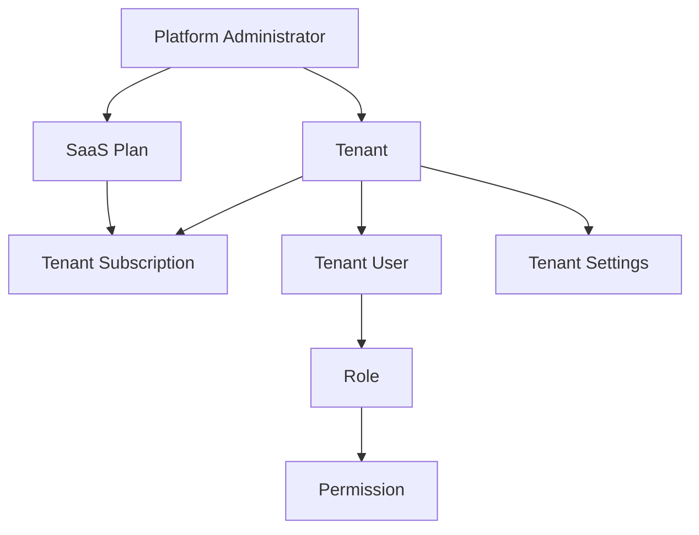

---

# 6. Phase 02 — Network Foundation

## Scope

- Routers
- Router management
- MikroTik integration
- FreeRADIUS
- IPAM
- NOC
- OLTs
- PON ports
- Fiber routes
- Splitters
- Cabinets
- Distribution points
- ONTs / ONUs

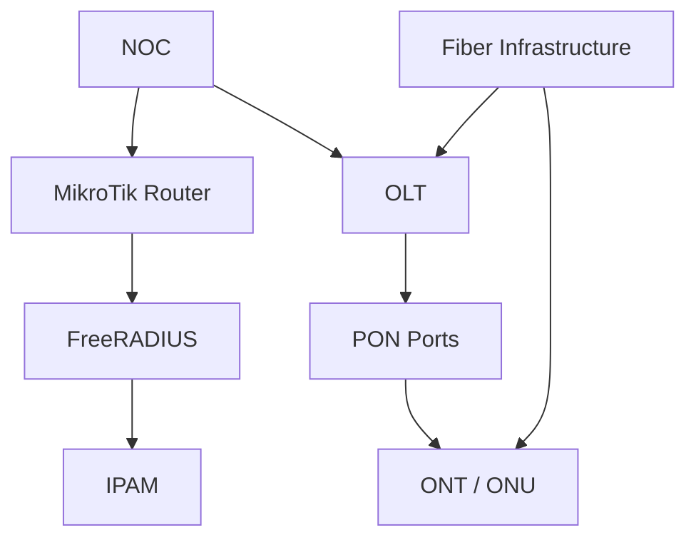

---

# 7. Phase 03 — Customer Foundation

## Scope

- ISP plans
- Clients
- Client accounts
- PPPoE accounts
- Hotspot accounts
- Static IP services
- Wallets
- Client notes, tags and custom fields
- Customer enrichment

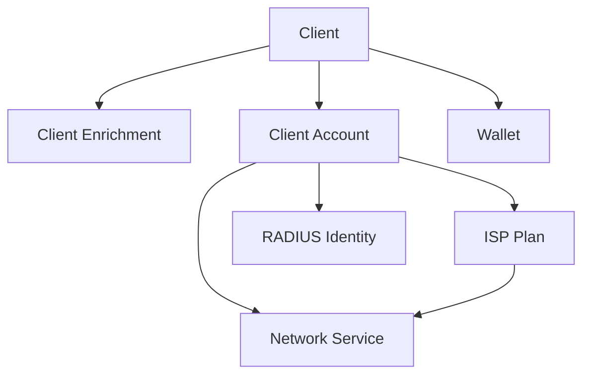

---

# 8. Phase 04 — Billing

## Scope

- Taxes
- Discounts
- Invoices
- Payments
- Payment allocations
- Ledger
- Usage
- Refunds
- Credit notes
- Debit notes
- Dunning
- Expenditure
- Commissions

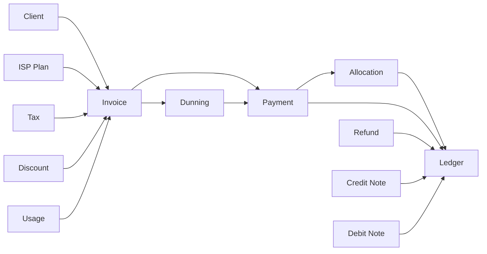

## Billing Lifecycle

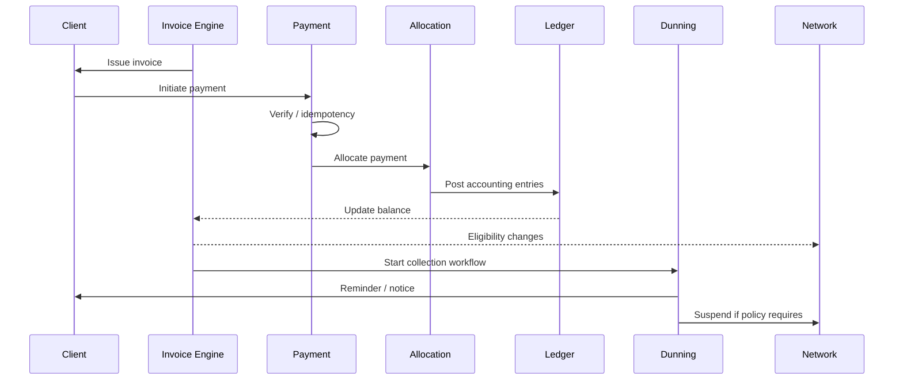

---

# 9. Phase 05 — Inventory

## Scope

- Warehouses
- Suppliers
- Inventory items
- Stock movements
- Purchase orders
- Item assignments
- Returns
- Low-stock monitoring

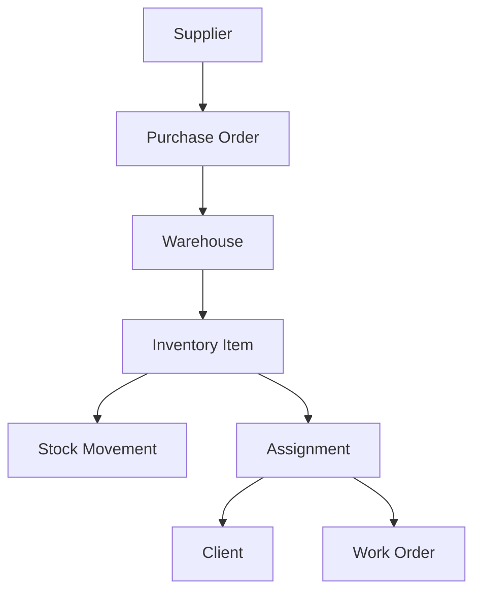

---

# 10. Phase 06 — Support

## Scope

- Departments
- Queues
- Categories
- SLA policies
- Knowledge base
- Tickets
- Maintenance
- Work orders
- Work order parts
- Technician assignment

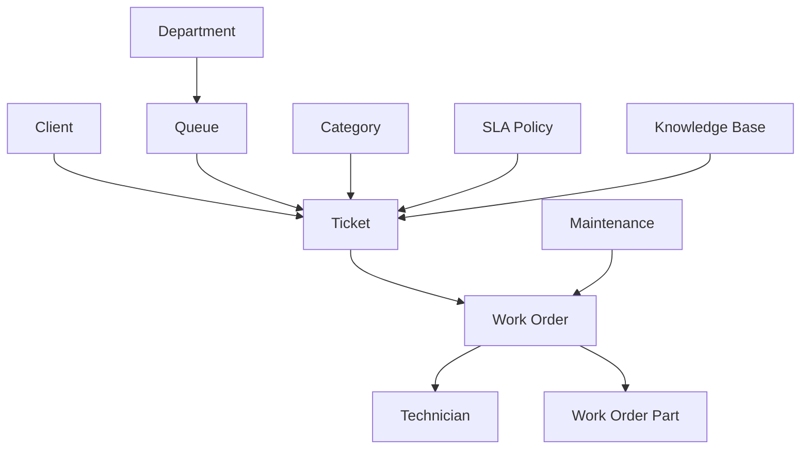

---

# 11. Phase 07 — CRM / Communication

## Scope

- Leads
- Campaigns
- Customer experience
- Templates
- Communication logs
- Notifications
- Announcements
- Webhooks

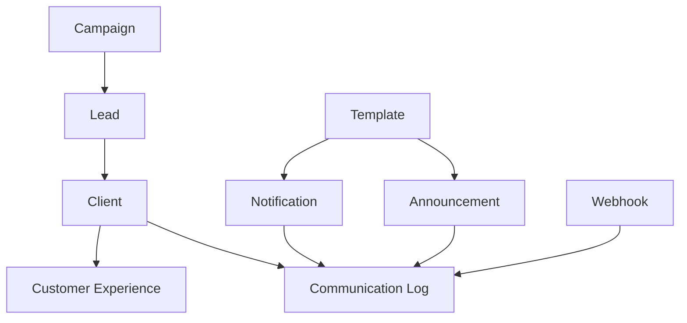

---

# 12. Phase 08 — Operations

## Scope

- RADIUS sessions
- Network traffic
- ONT signal history
- ONT events
- SMS logs
- Network telemetry
- Operational event history

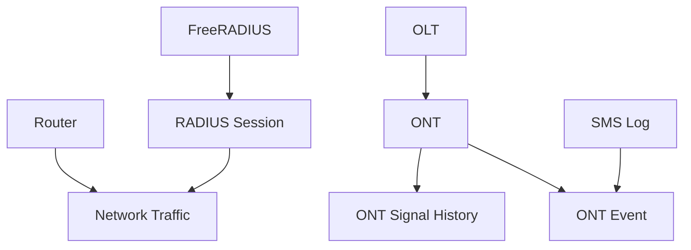

---

# 13. Phase 09 — Reporting

## Scope

- Dashboards
- Saved reports
- Report schedules
- Revenue reporting
- Customer reporting
- Network reporting
- Support reporting
- Inventory reporting
- Operational reporting

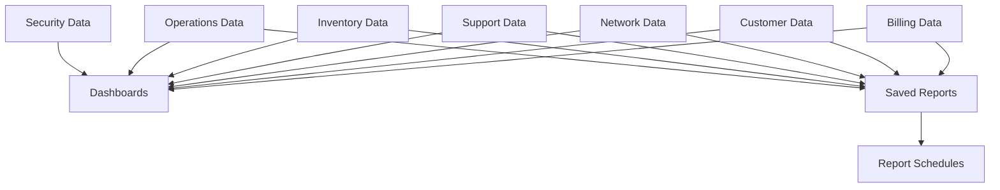

---

# 14. Phase 10 — Security

## Scope

- Security events
- User devices
- Login history
- MFA recovery codes
- TOTP MFA
- API/session security
- Authentication
- Authorization
- Audit trails

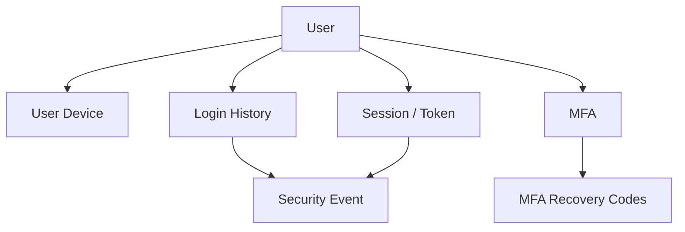

---

# 15. Multi-Tenant Request Flow

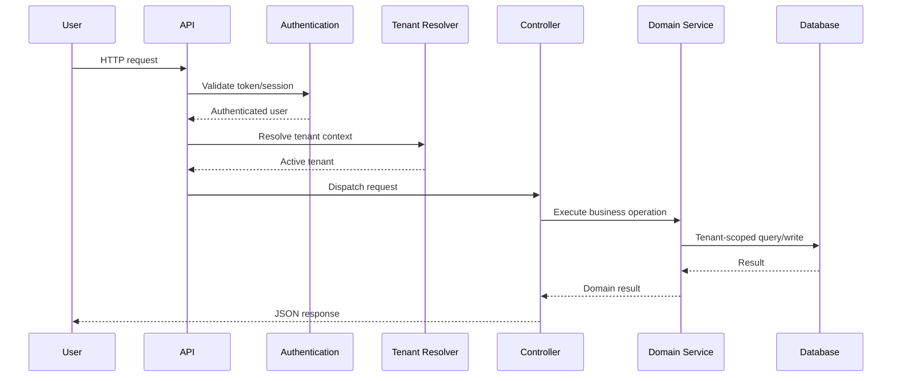

---

# 16. Network Provisioning Flow

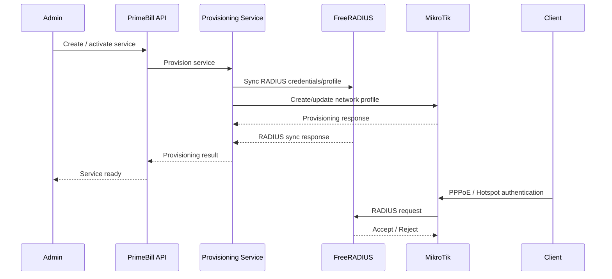

---

# 17. M-Pesa Payment Flow

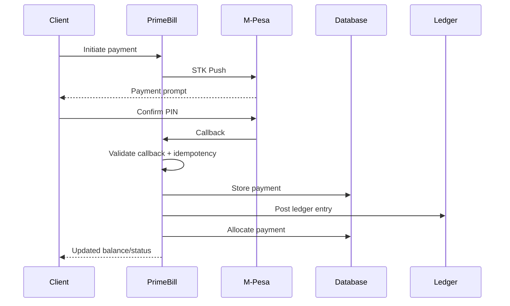

---

# 18. Background Processing

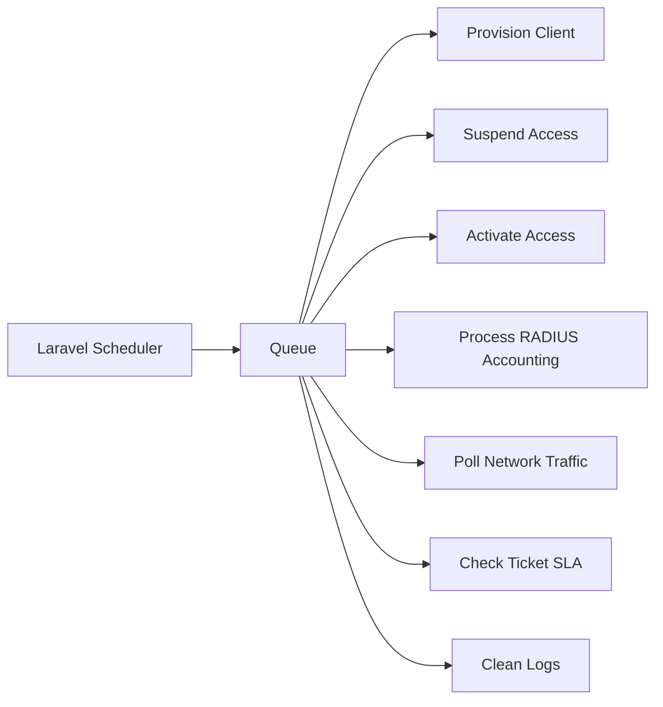

---

# 19. Core Data Flow

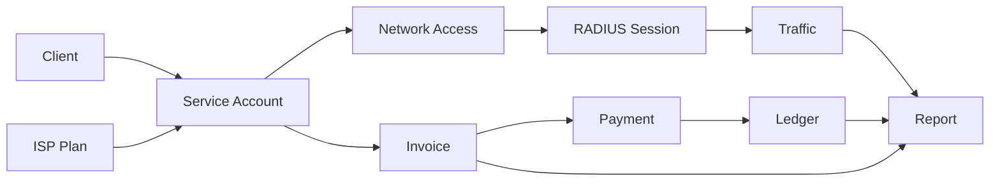

---

# 20. API Organization

Primary locations:

| Area | Location |
|---|---|
| API routes | `routes/api.php` |
| API controllers | `app/Http/Controllers/Api` |
| Portal controllers | `app/Http/Controllers/Portal` |
| Models | `app/Models` |
| Domain services | `app/Services` |
| Jobs | `app/Jobs` |
| Events / listeners | `app/Events`, `app/Listeners` |
| Console commands | `app/Console/Commands` |
| Migrations | `database/migrations` |
| Seeders | `database/seeders` |
| Factories | `database/factories` |
| Tests | `tests/` |
| Invoice PDF | `resources/views/pdf/invoice.blade.php` |

---

# 21. Technology Stack

| Technology | Role |
|---|---|
| Laravel 12 | Backend application framework |
| PHP 8.2+ | Application runtime |
| PostgreSQL | Primary relational database |
| Laravel Sanctum | API authentication |
| Spatie Permission | Roles and permissions |
| Laravel Queue | Background processing |
| Laravel Scheduler | Recurring operations |
| FreeRADIUS | AAA / subscriber authentication |
| MikroTik RouterOS API | Network provisioning and control |
| M-Pesa Daraja | Mobile-money payments |
| SMS gateways | Customer communications |
| DomPDF | Invoice PDF generation |

---

# 22. Authentication & Authorization

PrimeBill uses authenticated API access and tenant-aware authorization.

Typical roles include:

| Role | Scope |
|---|---|
| `super_admin` | Broad administrative access |
| `admin` | Tenant administration |
| `staff` | Customer and billing operations |
| `support` | Tickets and customer support |
| `technician` | Network and field operations |
| `finance` | Billing and financial operations |
| `client` | Self-service portal |

Platform administrators are represented separately through the platform-admin capability.

---

# 23. Client Lifecycle

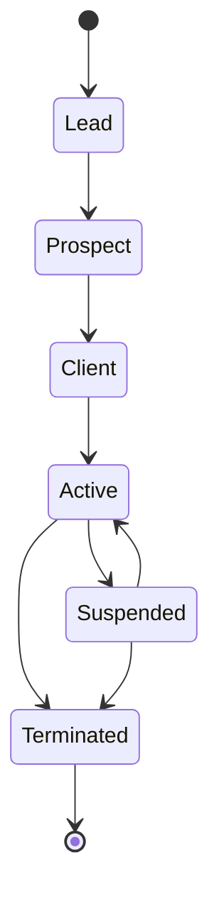

---

# 24. Service Lifecycle

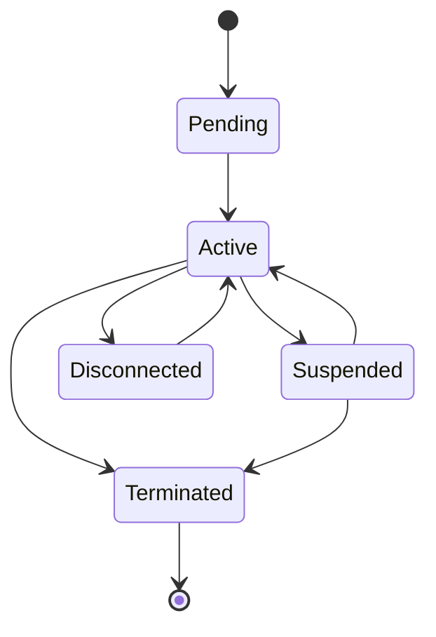

---

# 25. Billing State Model

```mermaid
stateDiagram-v2
    [*] --> Draft
    Draft --> Issued
    Issued --> PartiallyPaid
    Issued --> Paid
    Issued --> Overdue
    PartiallyPaid --> Paid
    PartiallyPaid --> Overdue
    Overdue --> PartiallyPaid
    Overdue --> Paid
    Overdue --> Dunning
    Dunning --> Paid
    Dunning --> Suspended
    Issued --> Cancelled
    Draft --> Cancelled
    Paid --> [*]
    Cancelled --> [*]
```

---

# 26. Seed Data

The seed system is intended to establish a coherent development/demo environment across the platform domains.

Default demo tenants:

| Tenant | Slug |
|---|---|
| PrimeNet ISP | `primenet-isp` |
| SwiftLink Communications | `swiftlink-communications` |
| MetroWave Internet | `metrowave-internet` |

Each demo tenant receives five staff accounts:

```text
{slug}.admin@primebill.test
{slug}.staff@primebill.test
{slug}.support@primebill.test
{slug}.technician@primebill.test
{slug}.finance@primebill.test
```

Default demo password:

```text
Demo@1234
```

Override it using:

```env
SEED_DEMO_PASSWORD=
```

The platform administrator can be created using:

```bash
php artisan platform:make-admin platform@primebill.co.ke
```

A dedicated development platform admin is also seeded automatically by
`PlatformAdminSeeder` (runs as part of `php artisan migrate:fresh --seed`,
skips itself in production):

| Name | Email | Password |
|---|---|---|
| Platform Administrator | `platform@primebill.test` | `Demo@1234` |

### Seeder Coverage Principle

Seeders should respect dependency order:

```mermaid
flowchart TD
    PLATFORM["Platform Base"]
    TENANT["Tenants"]
    ROLES["Roles / Permissions"]
    USERS["Tenant Users"]
    PLANS["SaaS / ISP Plans"]
    NETWORK["Network Foundation"]
    CLIENTS["Clients / Accounts"]
    BILLING["Billing"]
    INVENTORY["Inventory"]
    SUPPORT["Support"]
    CRM["CRM"]
    OPS["Operations"]
    REPORTING["Reporting"]
    SECURITY["Security"]

    PLATFORM --> TENANT
    PLATFORM --> ROLES
    TENANT --> USERS
    ROLES --> USERS
    TENANT --> PLANS
    TENANT --> NETWORK
    PLANS --> CLIENTS
    NETWORK --> CLIENTS
    CLIENTS --> BILLING
    TENANT --> INVENTORY
    CLIENTS --> SUPPORT
    CLIENTS --> CRM
    NETWORK --> OPS
    BILLING --> REPORTING
    NETWORK --> REPORTING
    SUPPORT --> REPORTING
    INVENTORY --> REPORTING
    SECURITY --> REPORTING
```

---

# 27. Installation

## Requirements

- PHP 8.2+
- Composer
- Node.js 20+
- npm
- MySQL or MariaDB
- Optional FreeRADIUS
- Optional MikroTik RouterOS device
- Optional M-Pesa Daraja credentials
- Optional SMS provider credentials

## Setup

```bash
composer install
cp .env.example .env
php artisan key:generate
php artisan migrate --seed
npm install
npm run build
```

Run development services:

```bash
composer run dev
```

Run tests:

```bash
composer test
```

or:

```bash
php artisan test
```

---

# 28. Environment Variables

| Variable | Purpose |
|---|---|
| `APP_ENV` | Application environment |
| `APP_URL` | Application URL |
| `DB_CONNECTION` | Database driver |
| `DB_HOST` | Database host |
| `DB_DATABASE` | Database name |
| `DB_USERNAME` | Database username |
| `DB_PASSWORD` | Database password |
| `SEED_DEMO_PASSWORD` | Demo seed password |
| `MPESA_ENV` | `sandbox` or `production` |
| `MPESA_SHORTCODE` | M-Pesa shortcode |
| `MPESA_CONSUMER_KEY` | Daraja consumer key |
| `MPESA_CONSUMER_SECRET` | Daraja consumer secret |
| `MPESA_PASSKEY` | Daraja passkey |
| `SMS_GATEWAY` | SMS provider |
| `RADIUS_DRIVER` | `freeradius` or `mock` |
| `NETWORK_ROUTER_DRIVER` | `mikrotik` or `mock` |

Never commit real credentials.

---

# 29. Testing

The backend should be validated at several levels:

```mermaid
flowchart TB
    UNIT["Unit Tests"]
    FEATURE["Feature Tests"]
    API["API Tests"]
    INTEGRATION["Integration Tests"]
    NETWORK["Network Adapter Tests"]
    PAYMENT["Payment Tests"]
    SECURITY["Security Tests"]

    UNIT --> FEATURE
    FEATURE --> API
    API --> INTEGRATION
    INTEGRATION --> NETWORK
    INTEGRATION --> PAYMENT
    API --> SECURITY
```

Run:

```bash
php artisan test
```

---

# 30. Network Integration

Development/testing can use mock adapters.

Production network operations require:

- reachable MikroTik routers
- valid RouterOS credentials
- reachable FreeRADIUS infrastructure
- valid OLT/ONT integration where applicable
- correct firewall/routing configuration
- appropriate secrets

The system should report integration failures rather than treating failed provisioning as successful.

---

# 31. M-Pesa Integration

PrimeBill supports:

- STK Push
- callback processing
- C2B integration
- callback verification
- idempotency
- payment persistence
- allocation
- ledger posting

Production payment processing requires valid Daraja credentials and registered callback endpoints.

---

# 32. Observability & Operations

Production deployment should include:

- queue monitoring
- scheduled-job monitoring
- application logging
- database backups
- failed-job handling
- network integration monitoring
- payment callback monitoring
- SMS delivery monitoring
- security-event monitoring
- alerting/incident response

---

# 33. API Design Principles

PrimeBill follows these principles:

1. Tenant-aware data access.
2. Explicit authorization.
3. Transactional financial operations.
4. Idempotent external callbacks.
5. Service-layer business logic for complex domains.
6. Queue-based processing for long-running work.
7. Adapter-based network integrations.
8. Auditability for sensitive operations.
9. Validation at API boundaries.
10. Clear failure responses rather than false success.

---

# 34. Current Capability Boundaries

The platform contains both real business logic and integration points that depend on external infrastructure.

### Implemented / application-controlled

- Multi-tenancy
- Customer lifecycle
- Billing
- Payments
- Ledger
- Ticketing
- Inventory
- CRM
- Platform administration
- Authentication
- Security workflows
- Reporting foundations
- Network adapter architecture

### Environment-dependent

- Live MikroTik provisioning
- Live FreeRADIUS authentication/accounting
- OLT telemetry
- Real M-Pesa traffic
- SMS delivery
- Production email
- Production queue infrastructure

A development environment should use mock adapters where physical infrastructure is unavailable.

---

# 35. Related Repository

Frontend:

`https://github.com/Onesmuschege/primebill-frontend`

Backend:

`https://github.com/Onesmuschege/primebill-api`

---

# 36. License

Proprietary — All rights reserved.

Unauthorized copying, distribution, modification, or commercial use is prohibited.

---

## PrimeBill ISP Platform — Server

**Built for modern ISP operations and Kenyan broadband businesses.**
